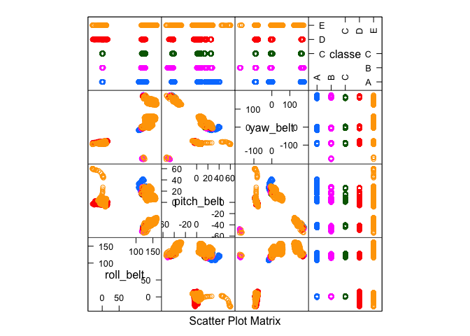

Project description
-------------------

Using devices such as Jawbone Up, Nike FuelBand, and Fitbit it is now possible to collect a large amount of data about personal activity relatively inexpensively. These type of devices are part of the quantified self movement – a group of enthusiasts who take measurements about themselves regularly to improve their health, to find patterns in their behavior, or because they are tech geeks. One thing that people regularly do is quantify how much of a particular activity they do, but they rarely quantify how well they do it.

In this project, my goal will be to use data from accelerometers on the belt, forearm, arm, and dumbell of 6 participants. They were asked to perform barbell lifts correctly and incorrectly in 5 different ways.

The goal of this project is to predict the manner in which they did the exercise. This is the "classe" variable in the next training set:

``` r
library(dplyr)
```

    ## 
    ## Attaching package: 'dplyr'

    ## The following objects are masked from 'package:stats':
    ## 
    ##     filter, lag

    ## The following objects are masked from 'package:base':
    ## 
    ##     intersect, setdiff, setequal, union

``` r
library(caret)
```

    ## Loading required package: lattice

    ## Loading required package: ggplot2

``` r
load("~/Desktop/R projects/WLE prediction/session.RData")
trainData <- read.csv("pml-training.csv", header = T, sep =",", stringsAsFactors = FALSE)
str(trainData)
```

    ## 'data.frame':    19622 obs. of  160 variables:
    ##  $ X                       : int  1 2 3 4 5 6 7 8 9 10 ...
    ##  $ user_name               : chr  "carlitos" "carlitos" "carlitos" "carlitos" ...
    ##  $ raw_timestamp_part_1    : int  1323084231 1323084231 1323084231 1323084232 1323084232 1323084232 1323084232 1323084232 1323084232 1323084232 ...
    ##  $ raw_timestamp_part_2    : int  788290 808298 820366 120339 196328 304277 368296 440390 484323 484434 ...
    ##  $ cvtd_timestamp          : chr  "05/12/2011 11:23" "05/12/2011 11:23" "05/12/2011 11:23" "05/12/2011 11:23" ...
    ##  $ new_window              : chr  "no" "no" "no" "no" ...
    ##  $ num_window              : int  11 11 11 12 12 12 12 12 12 12 ...
    ##  $ roll_belt               : num  1.41 1.41 1.42 1.48 1.48 1.45 1.42 1.42 1.43 1.45 ...
    ##  $ pitch_belt              : num  8.07 8.07 8.07 8.05 8.07 8.06 8.09 8.13 8.16 8.17 ...
    ##  $ yaw_belt                : num  -94.4 -94.4 -94.4 -94.4 -94.4 -94.4 -94.4 -94.4 -94.4 -94.4 ...
    ##  $ total_accel_belt        : int  3 3 3 3 3 3 3 3 3 3 ...
    ##  $ kurtosis_roll_belt      : chr  "" "" "" "" ...
    ##  $ kurtosis_picth_belt     : chr  "" "" "" "" ...
    ##  $ kurtosis_yaw_belt       : chr  "" "" "" "" ...
    ##  $ skewness_roll_belt      : chr  "" "" "" "" ...
    ##  $ skewness_roll_belt.1    : chr  "" "" "" "" ...
    ##  $ skewness_yaw_belt       : chr  "" "" "" "" ...
    ##  $ max_roll_belt           : num  NA NA NA NA NA NA NA NA NA NA ...
    ##  $ max_picth_belt          : int  NA NA NA NA NA NA NA NA NA NA ...
    ##  $ max_yaw_belt            : chr  "" "" "" "" ...
    ##  $ min_roll_belt           : num  NA NA NA NA NA NA NA NA NA NA ...
    ##  $ min_pitch_belt          : int  NA NA NA NA NA NA NA NA NA NA ...
    ##  $ min_yaw_belt            : chr  "" "" "" "" ...
    ##  $ amplitude_roll_belt     : num  NA NA NA NA NA NA NA NA NA NA ...
    ##  $ amplitude_pitch_belt    : int  NA NA NA NA NA NA NA NA NA NA ...
    ##  $ amplitude_yaw_belt      : chr  "" "" "" "" ...
    ##  $ var_total_accel_belt    : num  NA NA NA NA NA NA NA NA NA NA ...
    ##  $ avg_roll_belt           : num  NA NA NA NA NA NA NA NA NA NA ...
    ##  $ stddev_roll_belt        : num  NA NA NA NA NA NA NA NA NA NA ...
    ##  $ var_roll_belt           : num  NA NA NA NA NA NA NA NA NA NA ...
    ##  $ avg_pitch_belt          : num  NA NA NA NA NA NA NA NA NA NA ...
    ##  $ stddev_pitch_belt       : num  NA NA NA NA NA NA NA NA NA NA ...
    ##  $ var_pitch_belt          : num  NA NA NA NA NA NA NA NA NA NA ...
    ##  $ avg_yaw_belt            : num  NA NA NA NA NA NA NA NA NA NA ...
    ##  $ stddev_yaw_belt         : num  NA NA NA NA NA NA NA NA NA NA ...
    ##  $ var_yaw_belt            : num  NA NA NA NA NA NA NA NA NA NA ...
    ##  $ gyros_belt_x            : num  0 0.02 0 0.02 0.02 0.02 0.02 0.02 0.02 0.03 ...
    ##  $ gyros_belt_y            : num  0 0 0 0 0.02 0 0 0 0 0 ...
    ##  $ gyros_belt_z            : num  -0.02 -0.02 -0.02 -0.03 -0.02 -0.02 -0.02 -0.02 -0.02 0 ...
    ##  $ accel_belt_x            : int  -21 -22 -20 -22 -21 -21 -22 -22 -20 -21 ...
    ##  $ accel_belt_y            : int  4 4 5 3 2 4 3 4 2 4 ...
    ##  $ accel_belt_z            : int  22 22 23 21 24 21 21 21 24 22 ...
    ##  $ magnet_belt_x           : int  -3 -7 -2 -6 -6 0 -4 -2 1 -3 ...
    ##  $ magnet_belt_y           : int  599 608 600 604 600 603 599 603 602 609 ...
    ##  $ magnet_belt_z           : int  -313 -311 -305 -310 -302 -312 -311 -313 -312 -308 ...
    ##  $ roll_arm                : num  -128 -128 -128 -128 -128 -128 -128 -128 -128 -128 ...
    ##  $ pitch_arm               : num  22.5 22.5 22.5 22.1 22.1 22 21.9 21.8 21.7 21.6 ...
    ##  $ yaw_arm                 : num  -161 -161 -161 -161 -161 -161 -161 -161 -161 -161 ...
    ##  $ total_accel_arm         : int  34 34 34 34 34 34 34 34 34 34 ...
    ##  $ var_accel_arm           : num  NA NA NA NA NA NA NA NA NA NA ...
    ##  $ avg_roll_arm            : num  NA NA NA NA NA NA NA NA NA NA ...
    ##  $ stddev_roll_arm         : num  NA NA NA NA NA NA NA NA NA NA ...
    ##  $ var_roll_arm            : num  NA NA NA NA NA NA NA NA NA NA ...
    ##  $ avg_pitch_arm           : num  NA NA NA NA NA NA NA NA NA NA ...
    ##  $ stddev_pitch_arm        : num  NA NA NA NA NA NA NA NA NA NA ...
    ##  $ var_pitch_arm           : num  NA NA NA NA NA NA NA NA NA NA ...
    ##  $ avg_yaw_arm             : num  NA NA NA NA NA NA NA NA NA NA ...
    ##  $ stddev_yaw_arm          : num  NA NA NA NA NA NA NA NA NA NA ...
    ##  $ var_yaw_arm             : num  NA NA NA NA NA NA NA NA NA NA ...
    ##  $ gyros_arm_x             : num  0 0.02 0.02 0.02 0 0.02 0 0.02 0.02 0.02 ...
    ##  $ gyros_arm_y             : num  0 -0.02 -0.02 -0.03 -0.03 -0.03 -0.03 -0.02 -0.03 -0.03 ...
    ##  $ gyros_arm_z             : num  -0.02 -0.02 -0.02 0.02 0 0 0 0 -0.02 -0.02 ...
    ##  $ accel_arm_x             : int  -288 -290 -289 -289 -289 -289 -289 -289 -288 -288 ...
    ##  $ accel_arm_y             : int  109 110 110 111 111 111 111 111 109 110 ...
    ##  $ accel_arm_z             : int  -123 -125 -126 -123 -123 -122 -125 -124 -122 -124 ...
    ##  $ magnet_arm_x            : int  -368 -369 -368 -372 -374 -369 -373 -372 -369 -376 ...
    ##  $ magnet_arm_y            : int  337 337 344 344 337 342 336 338 341 334 ...
    ##  $ magnet_arm_z            : int  516 513 513 512 506 513 509 510 518 516 ...
    ##  $ kurtosis_roll_arm       : chr  "" "" "" "" ...
    ##  $ kurtosis_picth_arm      : chr  "" "" "" "" ...
    ##  $ kurtosis_yaw_arm        : chr  "" "" "" "" ...
    ##  $ skewness_roll_arm       : chr  "" "" "" "" ...
    ##  $ skewness_pitch_arm      : chr  "" "" "" "" ...
    ##  $ skewness_yaw_arm        : chr  "" "" "" "" ...
    ##  $ max_roll_arm            : num  NA NA NA NA NA NA NA NA NA NA ...
    ##  $ max_picth_arm           : num  NA NA NA NA NA NA NA NA NA NA ...
    ##  $ max_yaw_arm             : int  NA NA NA NA NA NA NA NA NA NA ...
    ##  $ min_roll_arm            : num  NA NA NA NA NA NA NA NA NA NA ...
    ##  $ min_pitch_arm           : num  NA NA NA NA NA NA NA NA NA NA ...
    ##  $ min_yaw_arm             : int  NA NA NA NA NA NA NA NA NA NA ...
    ##  $ amplitude_roll_arm      : num  NA NA NA NA NA NA NA NA NA NA ...
    ##  $ amplitude_pitch_arm     : num  NA NA NA NA NA NA NA NA NA NA ...
    ##  $ amplitude_yaw_arm       : int  NA NA NA NA NA NA NA NA NA NA ...
    ##  $ roll_dumbbell           : num  13.1 13.1 12.9 13.4 13.4 ...
    ##  $ pitch_dumbbell          : num  -70.5 -70.6 -70.3 -70.4 -70.4 ...
    ##  $ yaw_dumbbell            : num  -84.9 -84.7 -85.1 -84.9 -84.9 ...
    ##  $ kurtosis_roll_dumbbell  : chr  "" "" "" "" ...
    ##  $ kurtosis_picth_dumbbell : chr  "" "" "" "" ...
    ##  $ kurtosis_yaw_dumbbell   : chr  "" "" "" "" ...
    ##  $ skewness_roll_dumbbell  : chr  "" "" "" "" ...
    ##  $ skewness_pitch_dumbbell : chr  "" "" "" "" ...
    ##  $ skewness_yaw_dumbbell   : chr  "" "" "" "" ...
    ##  $ max_roll_dumbbell       : num  NA NA NA NA NA NA NA NA NA NA ...
    ##  $ max_picth_dumbbell      : num  NA NA NA NA NA NA NA NA NA NA ...
    ##  $ max_yaw_dumbbell        : chr  "" "" "" "" ...
    ##  $ min_roll_dumbbell       : num  NA NA NA NA NA NA NA NA NA NA ...
    ##  $ min_pitch_dumbbell      : num  NA NA NA NA NA NA NA NA NA NA ...
    ##  $ min_yaw_dumbbell        : chr  "" "" "" "" ...
    ##  $ amplitude_roll_dumbbell : num  NA NA NA NA NA NA NA NA NA NA ...
    ##   [list output truncated]

Let's see variables frequency ratio and percent of unique variables in this dataset.

It also required to change the type of a variable "classe" as factor.

``` r
trainData$classe <- as.factor(trainData$classe)
nearZeroVar(trainData, saveMetrics = TRUE)
```

    ##                            freqRatio percentUnique zeroVar   nzv
    ## X                           1.000000  100.00000000   FALSE FALSE
    ## user_name                   1.100679    0.03057792   FALSE FALSE
    ## raw_timestamp_part_1        1.000000    4.26562022   FALSE FALSE
    ## raw_timestamp_part_2        1.000000   85.53154622   FALSE FALSE
    ## cvtd_timestamp              1.000668    0.10192641   FALSE FALSE
    ## new_window                 47.330049    0.01019264   FALSE  TRUE
    ## num_window                  1.000000    4.37264295   FALSE FALSE
    ## roll_belt                   1.101904    6.77810621   FALSE FALSE
    ## pitch_belt                  1.036082    9.37722964   FALSE FALSE
    ## yaw_belt                    1.058480    9.97349913   FALSE FALSE
    ## total_accel_belt            1.063160    0.14779329   FALSE FALSE
    ## kurtosis_roll_belt       1921.600000    2.02323922   FALSE  TRUE
    ## kurtosis_picth_belt       600.500000    1.61553358   FALSE  TRUE
    ## kurtosis_yaw_belt          47.330049    0.01019264   FALSE  TRUE
    ## skewness_roll_belt       2135.111111    2.01304658   FALSE  TRUE
    ## skewness_roll_belt.1      600.500000    1.72255631   FALSE  TRUE
    ## skewness_yaw_belt          47.330049    0.01019264   FALSE  TRUE
    ## max_roll_belt               1.000000    0.99378249   FALSE FALSE
    ## max_picth_belt              1.538462    0.11211905   FALSE FALSE
    ## max_yaw_belt              640.533333    0.34654979   FALSE  TRUE
    ## min_roll_belt               1.000000    0.93772296   FALSE FALSE
    ## min_pitch_belt              2.192308    0.08154113   FALSE FALSE
    ## min_yaw_belt              640.533333    0.34654979   FALSE  TRUE
    ## amplitude_roll_belt         1.290323    0.75425543   FALSE FALSE
    ## amplitude_pitch_belt        3.042254    0.06625217   FALSE FALSE
    ## amplitude_yaw_belt         50.041667    0.02038528   FALSE  TRUE
    ## var_total_accel_belt        1.426829    0.33126083   FALSE FALSE
    ## avg_roll_belt               1.066667    0.97339721   FALSE FALSE
    ## stddev_roll_belt            1.039216    0.35164611   FALSE FALSE
    ## var_roll_belt               1.615385    0.48924676   FALSE FALSE
    ## avg_pitch_belt              1.375000    1.09061258   FALSE FALSE
    ## stddev_pitch_belt           1.161290    0.21914178   FALSE FALSE
    ## var_pitch_belt              1.307692    0.32106819   FALSE FALSE
    ## avg_yaw_belt                1.200000    1.22311691   FALSE FALSE
    ## stddev_yaw_belt             1.693878    0.29558659   FALSE FALSE
    ## var_yaw_belt                1.500000    0.73896647   FALSE FALSE
    ## gyros_belt_x                1.058651    0.71348486   FALSE FALSE
    ## gyros_belt_y                1.144000    0.35164611   FALSE FALSE
    ## gyros_belt_z                1.066214    0.86127816   FALSE FALSE
    ## accel_belt_x                1.055412    0.83579655   FALSE FALSE
    ## accel_belt_y                1.113725    0.72877383   FALSE FALSE
    ## accel_belt_z                1.078767    1.52379982   FALSE FALSE
    ## magnet_belt_x               1.090141    1.66649679   FALSE FALSE
    ## magnet_belt_y               1.099688    1.51870350   FALSE FALSE
    ## magnet_belt_z               1.006369    2.32901845   FALSE FALSE
    ## roll_arm                   52.338462   13.52563449   FALSE FALSE
    ## pitch_arm                  87.256410   15.73234125   FALSE FALSE
    ## yaw_arm                    33.029126   14.65701763   FALSE FALSE
    ## total_accel_arm             1.024526    0.33635715   FALSE FALSE
    ## var_accel_arm               5.500000    2.01304658   FALSE FALSE
    ## avg_roll_arm               77.000000    1.68178575   FALSE  TRUE
    ## stddev_roll_arm            77.000000    1.68178575   FALSE  TRUE
    ## var_roll_arm               77.000000    1.68178575   FALSE  TRUE
    ## avg_pitch_arm              77.000000    1.68178575   FALSE  TRUE
    ## stddev_pitch_arm           77.000000    1.68178575   FALSE  TRUE
    ## var_pitch_arm              77.000000    1.68178575   FALSE  TRUE
    ## avg_yaw_arm                77.000000    1.68178575   FALSE  TRUE
    ## stddev_yaw_arm             80.000000    1.66649679   FALSE  TRUE
    ## var_yaw_arm                80.000000    1.66649679   FALSE  TRUE
    ## gyros_arm_x                 1.015504    3.27693405   FALSE FALSE
    ## gyros_arm_y                 1.454369    1.91621649   FALSE FALSE
    ## gyros_arm_z                 1.110687    1.26388747   FALSE FALSE
    ## accel_arm_x                 1.017341    3.95984099   FALSE FALSE
    ## accel_arm_y                 1.140187    2.73672409   FALSE FALSE
    ## accel_arm_z                 1.128000    4.03628580   FALSE FALSE
    ## magnet_arm_x                1.000000    6.82397309   FALSE FALSE
    ## magnet_arm_y                1.056818    4.44399144   FALSE FALSE
    ## magnet_arm_z                1.036364    6.44684538   FALSE FALSE
    ## kurtosis_roll_arm         246.358974    1.68178575   FALSE  TRUE
    ## kurtosis_picth_arm        240.200000    1.67159311   FALSE  TRUE
    ## kurtosis_yaw_arm         1746.909091    2.01304658   FALSE  TRUE
    ## skewness_roll_arm         249.558442    1.68688207   FALSE  TRUE
    ## skewness_pitch_arm        240.200000    1.67159311   FALSE  TRUE
    ## skewness_yaw_arm         1746.909091    2.01304658   FALSE  TRUE
    ## max_roll_arm               25.666667    1.47793293   FALSE  TRUE
    ## max_picth_arm              12.833333    1.34033228   FALSE FALSE
    ## max_yaw_arm                 1.227273    0.25991234   FALSE FALSE
    ## min_roll_arm               19.250000    1.41677709   FALSE  TRUE
    ## min_pitch_arm              19.250000    1.47793293   FALSE  TRUE
    ## min_yaw_arm                 1.000000    0.19366018   FALSE FALSE
    ## amplitude_roll_arm         25.666667    1.55947406   FALSE  TRUE
    ## amplitude_pitch_arm        20.000000    1.49831821   FALSE  TRUE
    ## amplitude_yaw_arm           1.037037    0.25991234   FALSE FALSE
    ## roll_dumbbell               1.022388   84.20650290   FALSE FALSE
    ## pitch_dumbbell              2.277372   81.74498012   FALSE FALSE
    ## yaw_dumbbell                1.132231   83.48282540   FALSE FALSE
    ## kurtosis_roll_dumbbell   3843.200000    2.02833554   FALSE  TRUE
    ## kurtosis_picth_dumbbell  9608.000000    2.04362450   FALSE  TRUE
    ## kurtosis_yaw_dumbbell      47.330049    0.01019264   FALSE  TRUE
    ## skewness_roll_dumbbell   4804.000000    2.04362450   FALSE  TRUE
    ## skewness_pitch_dumbbell  9608.000000    2.04872082   FALSE  TRUE
    ## skewness_yaw_dumbbell      47.330049    0.01019264   FALSE  TRUE
    ## max_roll_dumbbell           1.000000    1.72255631   FALSE FALSE
    ## max_picth_dumbbell          1.333333    1.72765263   FALSE FALSE
    ## max_yaw_dumbbell          960.800000    0.37203139   FALSE  TRUE
    ## min_roll_dumbbell           1.000000    1.69197839   FALSE FALSE
    ## min_pitch_dumbbell          1.666667    1.81429008   FALSE FALSE
    ## min_yaw_dumbbell          960.800000    0.37203139   FALSE  TRUE
    ## amplitude_roll_dumbbell     8.000000    1.97227602   FALSE FALSE
    ## amplitude_pitch_dumbbell    8.000000    1.95189073   FALSE FALSE
    ## amplitude_yaw_dumbbell     47.920200    0.01528896   FALSE  TRUE
    ## total_accel_dumbbell        1.072634    0.21914178   FALSE FALSE
    ## var_accel_dumbbell          6.000000    1.95698706   FALSE FALSE
    ## avg_roll_dumbbell           1.000000    2.02323922   FALSE FALSE
    ## stddev_roll_dumbbell       16.000000    1.99266130   FALSE FALSE
    ## var_roll_dumbbell          16.000000    1.99266130   FALSE FALSE
    ## avg_pitch_dumbbell          1.000000    2.02323922   FALSE FALSE
    ## stddev_pitch_dumbbell      16.000000    1.99266130   FALSE FALSE
    ## var_pitch_dumbbell         16.000000    1.99266130   FALSE FALSE
    ## avg_yaw_dumbbell            1.000000    2.02323922   FALSE FALSE
    ## stddev_yaw_dumbbell        16.000000    1.99266130   FALSE FALSE
    ## var_yaw_dumbbell           16.000000    1.99266130   FALSE FALSE
    ## gyros_dumbbell_x            1.003268    1.22821323   FALSE FALSE
    ## gyros_dumbbell_y            1.264957    1.41677709   FALSE FALSE
    ## gyros_dumbbell_z            1.060100    1.04984201   FALSE FALSE
    ## accel_dumbbell_x            1.018018    2.16593619   FALSE FALSE
    ## accel_dumbbell_y            1.053061    2.37488533   FALSE FALSE
    ## accel_dumbbell_z            1.133333    2.08949139   FALSE FALSE
    ## magnet_dumbbell_x           1.098266    5.74864948   FALSE FALSE
    ## magnet_dumbbell_y           1.197740    4.30129447   FALSE FALSE
    ## magnet_dumbbell_z           1.020833    3.44511263   FALSE FALSE
    ## roll_forearm               11.589286   11.08959331   FALSE FALSE
    ## pitch_forearm              65.983051   14.85577413   FALSE FALSE
    ## yaw_forearm                15.322835   10.14677403   FALSE FALSE
    ## kurtosis_roll_forearm     228.761905    1.64101519   FALSE  TRUE
    ## kurtosis_picth_forearm    226.070588    1.64611151   FALSE  TRUE
    ## kurtosis_yaw_forearm       47.330049    0.01019264   FALSE  TRUE
    ## skewness_roll_forearm     231.518072    1.64611151   FALSE  TRUE
    ## skewness_pitch_forearm    226.070588    1.62572623   FALSE  TRUE
    ## skewness_yaw_forearm       47.330049    0.01019264   FALSE  TRUE
    ## max_roll_forearm           27.666667    1.38110284   FALSE  TRUE
    ## max_picth_forearm           2.964286    0.78992967   FALSE FALSE
    ## max_yaw_forearm           228.761905    0.22933442   FALSE  TRUE
    ## min_roll_forearm           27.666667    1.37091020   FALSE  TRUE
    ## min_pitch_forearm           2.862069    0.87147080   FALSE FALSE
    ## min_yaw_forearm           228.761905    0.22933442   FALSE  TRUE
    ## amplitude_roll_forearm     20.750000    1.49322189   FALSE  TRUE
    ## amplitude_pitch_forearm     3.269231    0.93262664   FALSE FALSE
    ## amplitude_yaw_forearm      59.677019    0.01528896   FALSE  TRUE
    ## total_accel_forearm         1.128928    0.35674243   FALSE FALSE
    ## var_accel_forearm           3.500000    2.03343186   FALSE FALSE
    ## avg_roll_forearm           27.666667    1.64101519   FALSE  TRUE
    ## stddev_roll_forearm        87.000000    1.63082255   FALSE  TRUE
    ## var_roll_forearm           87.000000    1.63082255   FALSE  TRUE
    ## avg_pitch_forearm          83.000000    1.65120783   FALSE  TRUE
    ## stddev_pitch_forearm       41.500000    1.64611151   FALSE  TRUE
    ## var_pitch_forearm          83.000000    1.65120783   FALSE  TRUE
    ## avg_yaw_forearm            83.000000    1.65120783   FALSE  TRUE
    ## stddev_yaw_forearm         85.000000    1.64101519   FALSE  TRUE
    ## var_yaw_forearm            85.000000    1.64101519   FALSE  TRUE
    ## gyros_forearm_x             1.059273    1.51870350   FALSE FALSE
    ## gyros_forearm_y             1.036554    3.77637346   FALSE FALSE
    ## gyros_forearm_z             1.122917    1.56457038   FALSE FALSE
    ## accel_forearm_x             1.126437    4.04647844   FALSE FALSE
    ## accel_forearm_y             1.059406    5.11160942   FALSE FALSE
    ## accel_forearm_z             1.006250    2.95586586   FALSE FALSE
    ## magnet_forearm_x            1.012346    7.76679238   FALSE FALSE
    ## magnet_forearm_y            1.246914    9.54031189   FALSE FALSE
    ## magnet_forearm_z            1.000000    8.57710733   FALSE FALSE
    ## classe                      1.469581    0.02548160   FALSE FALSE

We see a lot of columns with null values or with values that are extremely rare.

Let's continue with the following vars:

``` r
training_ <-  select(trainData, one_of(c("roll_belt",
                                     "pitch_belt",
                                     "yaw_belt",
                                     "magnet_belt_x",
                                     "magnet_belt_y",
                                     "magnet_belt_z",
                                     "roll_arm",
                                     "pitch_arm",
                                     "yaw_arm",
                                     "roll_dumbbell",
                                     "pitch_dumbbell",
                                     "yaw_dumbbell",
                                     "roll_forearm",
                                     "pitch_forearm",
                                     "yaw_forearm",
                                     "classe")))

inTrain <- createDataPartition(y=training_$classe,
                               p=0.7, list=FALSE)
training <- training_[inTrain,]
testing <- training_[-inTrain,]
dim(training); dim(testing)
```

    ## [1] 13737    16

    ## [1] 5885   16

And in order to test our models we've sliced training set for trainset and testset. Testset with 20 cases will be used for final validation.

Now let's see if this variables are correlated with different lifting modes.

``` r
featurePlot(x=training[,c("magnet_belt_x","magnet_belt_y","magnet_belt_z", "classe")],y = training$classe,plot="pairs")
```


``` r
featurePlot(x=training[,c("roll_forearm","pitch_forearm","yaw_forearm","classe")],y = training$classe,plot="pairs")
```


``` r
featurePlot(x=training[,c("roll_arm","pitch_arm","yaw_arm","classe")],y = training$classe,plot="pairs")
```


``` r
featurePlot(x=training[,c("roll_belt","pitch_belt","yaw_belt","classe")],y = training$classe,plot="pairs")
```



``` r
featurePlot(x=training[,c("roll_dumbbell","pitch_dumbbell","yaw_dumbbell","classe")],y = training$classe,plot="pairs")
```

 These variables are clearly similar with the description of modes. For example, we can see it on the pitch forearm for mode C. - lifting the dumbbell only halfway

Let's try to create the following models:

Predicting "classe" for testing set.

Verifying the quality of the models

``` r
confusionMatrix(pred_rf, testing$classe)
```

    ## Confusion Matrix and Statistics
    ## 
    ##           Reference
    ## Prediction    A    B    C    D    E
    ##          A 1673    3    0    0    0
    ##          B    0 1132    0    2    1
    ##          C    0    4 1022    1    2
    ##          D    0    0    3  960    1
    ##          E    1    0    1    1 1078
    ## 
    ## Overall Statistics
    ##                                           
    ##                Accuracy : 0.9966          
    ##                  95% CI : (0.9948, 0.9979)
    ##     No Information Rate : 0.2845          
    ##     P-Value [Acc > NIR] : < 2.2e-16       
    ##                                           
    ##                   Kappa : 0.9957          
    ##  Mcnemar's Test P-Value : NA              
    ## 
    ## Statistics by Class:
    ## 
    ##                      Class: A Class: B Class: C Class: D Class: E
    ## Sensitivity            0.9994   0.9939   0.9961   0.9959   0.9963
    ## Specificity            0.9993   0.9994   0.9986   0.9992   0.9994
    ## Pos Pred Value         0.9982   0.9974   0.9932   0.9959   0.9972
    ## Neg Pred Value         0.9998   0.9985   0.9992   0.9992   0.9992
    ## Prevalence             0.2845   0.1935   0.1743   0.1638   0.1839
    ## Detection Rate         0.2843   0.1924   0.1737   0.1631   0.1832
    ## Detection Prevalence   0.2848   0.1929   0.1749   0.1638   0.1837
    ## Balanced Accuracy      0.9993   0.9966   0.9973   0.9975   0.9978

``` r
confusionMatrix(pred_lda, testing$classe)
```

    ## Confusion Matrix and Statistics
    ## 
    ##           Reference
    ## Prediction    A    B    C    D    E
    ##          A 1210  311  309  134  216
    ##          B  161  427  103  227  133
    ##          C  114  175  488  106  149
    ##          D  161  153   69  402  131
    ##          E   28   73   57   95  453
    ## 
    ## Overall Statistics
    ##                                           
    ##                Accuracy : 0.5064          
    ##                  95% CI : (0.4935, 0.5192)
    ##     No Information Rate : 0.2845          
    ##     P-Value [Acc > NIR] : < 2.2e-16       
    ##                                           
    ##                   Kappa : 0.3687          
    ##  Mcnemar's Test P-Value : < 2.2e-16       
    ## 
    ## Statistics by Class:
    ## 
    ##                      Class: A Class: B Class: C Class: D Class: E
    ## Sensitivity            0.7228  0.37489  0.47563  0.41701  0.41867
    ## Specificity            0.7697  0.86852  0.88804  0.89555  0.94732
    ## Pos Pred Value         0.5550  0.40628  0.47287  0.43886  0.64164
    ## Neg Pred Value         0.8748  0.85271  0.88914  0.88690  0.87855
    ## Prevalence             0.2845  0.19354  0.17434  0.16381  0.18386
    ## Detection Rate         0.2056  0.07256  0.08292  0.06831  0.07698
    ## Detection Prevalence   0.3704  0.17859  0.17536  0.15565  0.11997
    ## Balanced Accuracy      0.7462  0.62171  0.68184  0.65628  0.68300

``` r
confusionMatrix(pred_nb, testing$classe)
```

    ## Confusion Matrix and Statistics
    ## 
    ##           Reference
    ## Prediction    A    B    C    D    E
    ##          A 1198  174   73  120   21
    ##          B  214  655  110   96   72
    ##          C  130  173  761  216  115
    ##          D  100  101   62  480   69
    ##          E   32   36   20   52  805
    ## 
    ## Overall Statistics
    ##                                           
    ##                Accuracy : 0.6625          
    ##                  95% CI : (0.6503, 0.6746)
    ##     No Information Rate : 0.2845          
    ##     P-Value [Acc > NIR] : < 2.2e-16       
    ##                                           
    ##                   Kappa : 0.574           
    ##  Mcnemar's Test P-Value : < 2.2e-16       
    ## 
    ## Statistics by Class:
    ## 
    ##                      Class: A Class: B Class: C Class: D Class: E
    ## Sensitivity            0.7157   0.5751   0.7417  0.49793   0.7440
    ## Specificity            0.9079   0.8963   0.8695  0.93253   0.9709
    ## Pos Pred Value         0.7554   0.5711   0.5455  0.59113   0.8519
    ## Neg Pred Value         0.8893   0.8978   0.9410  0.90459   0.9439
    ## Prevalence             0.2845   0.1935   0.1743  0.16381   0.1839
    ## Detection Rate         0.2036   0.1113   0.1293  0.08156   0.1368
    ## Detection Prevalence   0.2695   0.1949   0.2370  0.13798   0.1606
    ## Balanced Accuracy      0.8118   0.7357   0.8056  0.71523   0.8574

The best result - RandomForest.

Predicting of set with 20 test cases

``` r
test20 <- read.csv("pml-testing.csv", header = T, sep =",", stringsAsFactors = FALSE)
pred_final <- predict(fit_rf, test20)
pred_final
```

    ##  [1] B A B A A E D B A A B C B A E E A B B B
    ## Levels: A B C D E
